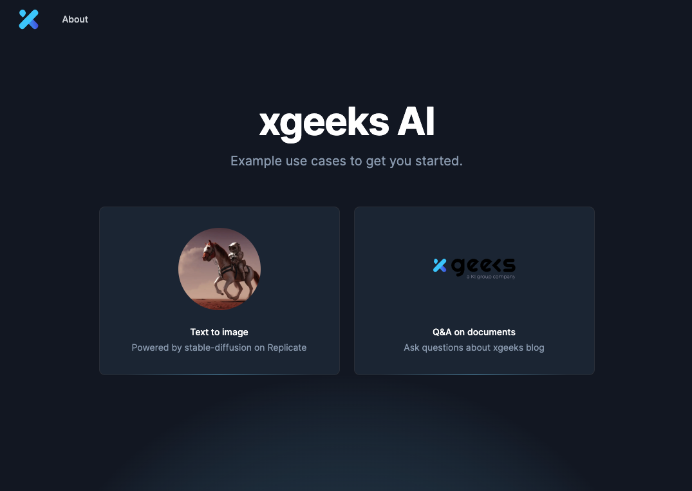

# Geekathon AI Starter Template

[Live Demo](https://geekathon-ai-starter-template.xgeeks.tech/)



## Stack

- App logic: [Next.js](https://nextjs.org/)
- VectorDB: [Pinecone](https://www.pinecone.io/)
- LLM Orchestration: [Langchain.js](https://js.langchain.com/docs/)
- Image Model: [Replicate](https://replicate.com/)
- Text Model: [OpenAI](https://platform.openai.com/docs/models)
- Text streaming: [ai sdk](https://github.com/vercel-labs/ai)
- Deployment: automatic on xgeeks platform for development.

## Overview

- 🚀 [Quickstart](#quickstart)

## Quickstart

The simplest way to try out this stack is to test it out locally and traverse through code files to understand how each component work. Here are the steps to get started.

### 1. Fork and Clone repo

Fork the repo to your Github account, then run the following command to clone the repo:

```
git clone git@github.com:xgeekshq/xgeeks-ai-starter-demo.git
```

### 2. Run Install Script

```sh
cd xgeeks-ai-starter-demo

# (SOS) make script executable: chmod +x run-install.sh
./run-install.sh
#
# script will:
## - install npm packages
## - create a .env file
```

### 3. Fill out secrets
```
you must update your .env.local file with all keys (OpenAI, Pinecone, Replicate)
```

#### 3.1 Geekathon provided secrets (OpenAI)
All Geekathon teams will receive an email with an API key for OpenAI.

#### 3.2 How to get secrets (Pinecone, Replicate)

a. **Replicate API key**
- Visit https://replicate.com/account/api-tokens to get your Replicate API key

b. **Pinecone API key**
- Create a Pinecone index by visiting https://app.pinecone.io/ and click on "Create Index"
- Give it an index name (this will be the environment variable `PINECONE_INDEX`)
- Fill in Dimension as `1536`
- Once the index is successfully created, click on "API Keys" on the left side nav and create an API key: copy "Environment" value to `PINECONE_ENVIRONMENT` variable, and "Value" to `PINECONE_API_KEY`


### 4. Generate embeddings

There are a few markdown files under `/blogs` directory as examples so you can do Q&A on them. To generate embeddings and store them in the vector database for future queries, **you just have to add the new files into this folder, and push a new commit.**
A github action will be triggered and will create and upload the new embeddings.

**NOTE 1:** the included files are already embedded. You don't have to do anything for those, just for new ones.
**NOTE 2:** it may take a minute or two to complete. Be patient.

### 4.1. Optionally you can do it manually

#### If using Pinecone

Run the following command to generate embeddings and store them in Pinecone:

```bash
npm run generate-embeddings-pinecone
```

### 5. Run app locally

Now you are ready to test out the app locally! To do this, simply run `npm run dev` under the project root.

### 6. Deploy the app

Just do your code and them commit. :rocket:
After a few seconds the changes will be live and running.
You can get some feedback, by looking the github actions pipelines, to check if they have finished.

## Refs

- https://js.langchain.com/docs/modules/indexes/vector_stores/integrations/pinecone
- https://js.langchain.com/docs/modules/models/llms/integrations#replicate
- https://js.langchain.com/docs/modules/chains/index_related_chains/retrieval_qa
